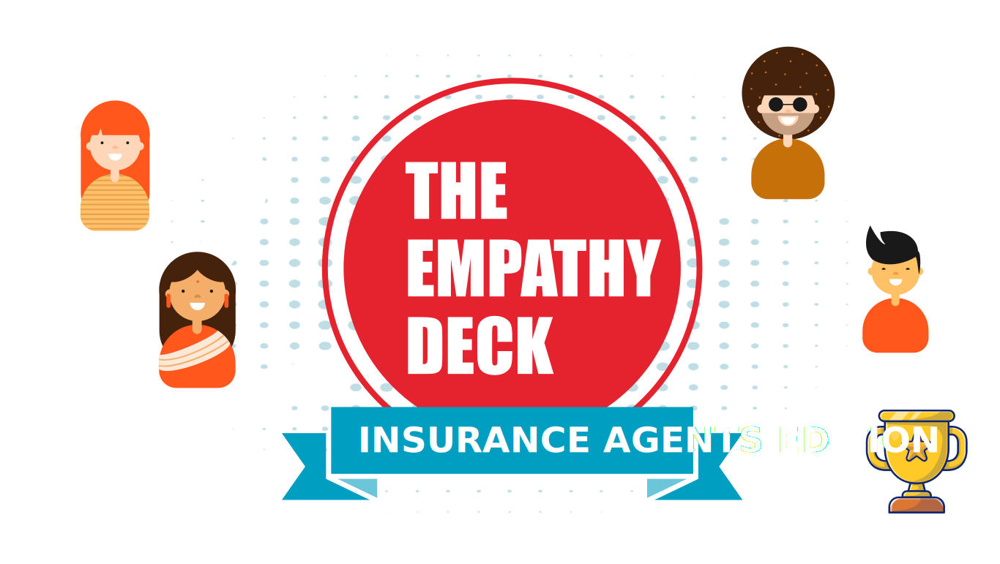

# The Empathy Deck: Insurance Agents

Welcome to The Empathy Deck: Insurance Agents, a browser-based card game designed to immerse players in the world of insurance agents. With every draw from the deck, players are given the chance to understand, empathize, and connect with diverse leads. Will you secure the trust of your leads, or will you lose them with a wrong choice? Dive in and let your empathy guide the way!

# Game Background

This game is a tribute to my previous work at PruExpert Labs to honour the memories, experiences and lessons I have gained. Especially the tech part of my work there has led me to this SEI course with my passion for tech reignited. I dedicate this game specifically to Leon, inspired by the dialogue tree scenarios for our L&D platform and also later on the AI based agent practice simulator in the roadmap he discussed. I have only gratitude.

## Objective:

The ultimate goal is to convert the lead before your turn counts end. You will risk losing your lead with the wrong choices.

## 

# Technologies Used:
Javascript, HTML, CSS

# Key Functions for Game Logic

initGame(): This function initializes the game by creating a new deck of cards and shuffling it. It then sets the current card index to 0 and renders the game screen.

updateGame(): This function updates the game state by incrementing the current card index and rendering the next card. If there are no more cards in the deck, it ends the game and renders the end screen.

restartGame(): This function restarts the game by resetting the current card index to 0 and rendering the game screen.

renderScreen(): This function renders the specified screen by setting the innerHTML of the main div to the screen's HTML template.

handleChoice(): This function handles the player's choice by updating the game state and rendering the next card.

updateProgressBar(): This function updates the progress bar by setting its width to the percentage of cards that have been played.

updateTrustLevel(): This function updates the trust level by setting the text of the trust level element to the current trust level.

updateCard(): This function updates the card by setting the text and image of the card to the current card's values.

updateChoices(): This function updates the choices by setting the text of the choice buttons to the current card's choices.

# Next Steps:

1. Timer for enhanced score mechanics
2. Enhanced Gameplay - to icrease turn count for conversion of multiple leads
3. Total Sales value as score
4. Power / Event Cards
5. Improved Aesthetics / UI

